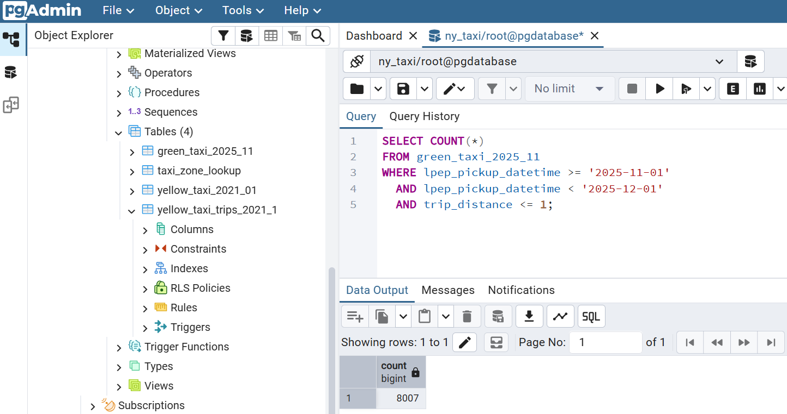
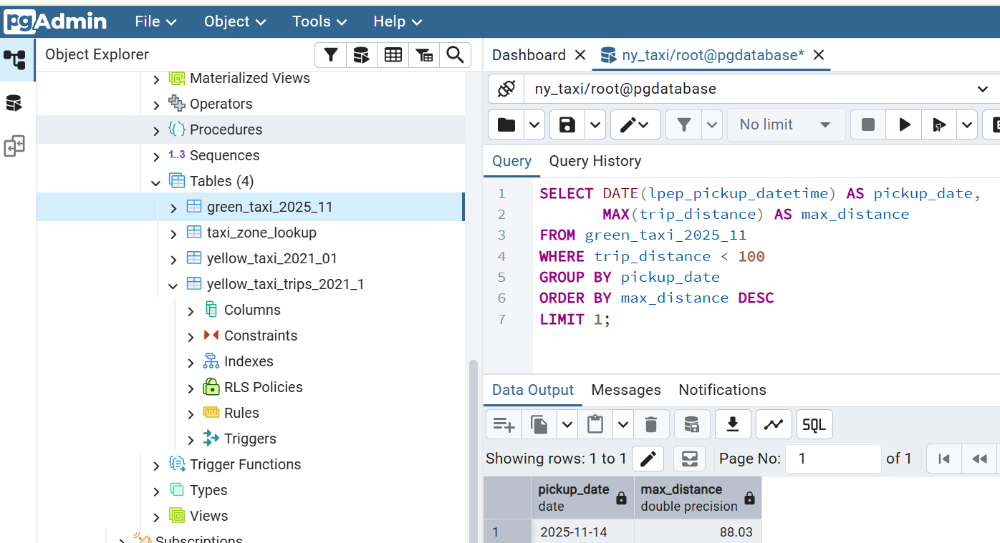
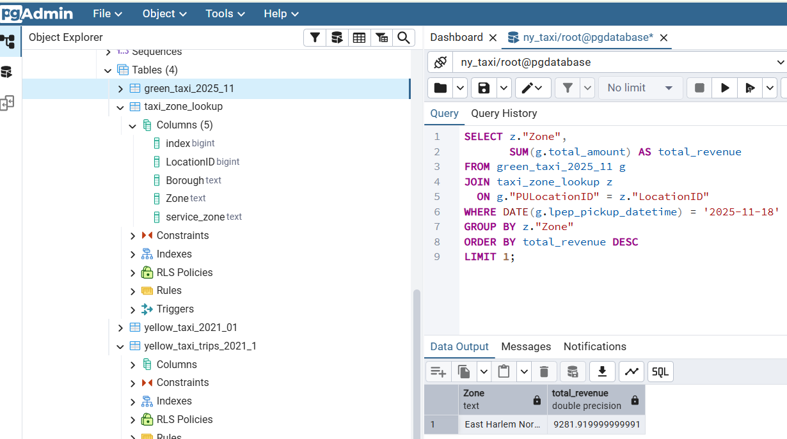
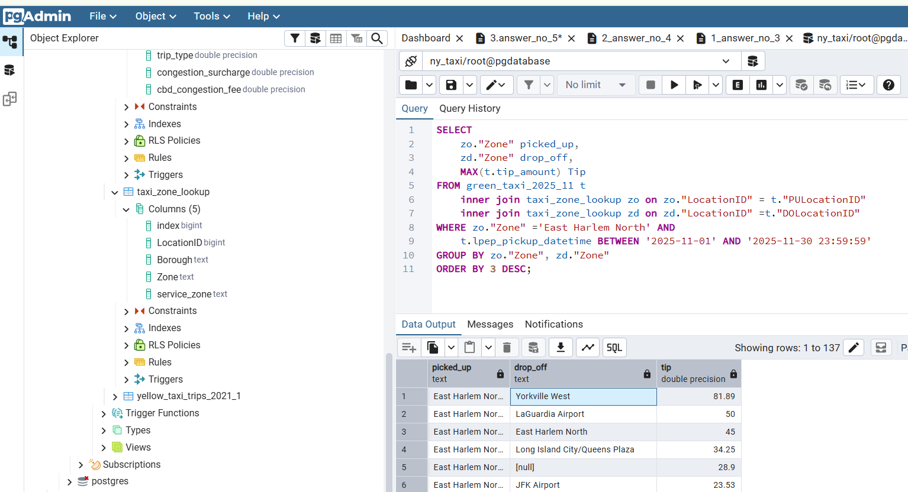

### Module 1 Homework: Docker, SQL & Terraform

This document contains the complete solutions for **Module 1 Homework**  
(Data Engineering Zoomcamp 2026 – DataTalksClub).

All commands, SQL queries, and answers are included directly in this Markdown file as required.

---

####  Ana Nurkaromah

- Homework: Module 1 – Docker & SQL
- Topic: Docker, SQL, Terraform

---

#### Question 1: Understanding Docker Images

Run Docker with the `python:3.13` image using bash as the entrypoint and identify the installed pip version.
the command to run docker with python 3.13 can be seen below:

```
bash
docker run -it --entrypoint bash python:3.13

#then, in order to identify the installed pip version use command below:
pip --version 
```
<br>

**Answer:**
**pip version: 25.3**

---

#### Question 2: Docker networking & docker-compose
Given the following docker-compose.yaml, determine the hostname and port that pgAdmin should use to connect to PostgreSQL.

the command to run can be seen below:
```
yaml

services:
  db:
    container_name: postgres
    image: postgres:17-alpine
    environment:
      POSTGRES_USER: postgres
      POSTGRES_PASSWORD: postgres
      POSTGRES_DB: ny_taxi
    ports:
      - "5433:5432"

  pgadmin:
    container_name: pgadmin
    image: dpage/pgadmin4:latest
    environment:
      PGADMIN_DEFAULT_EMAIL: pgadmin@pgadmin.com
      PGADMIN_DEFAULT_PASSWORD: pgadmin
    ports:
      - "8080:80"
```


- Docker Compose creates a shared internal network
- Service names act as hostnames
- Containers communicate using internal ports, not host ports

**Answer:**
**db:5432**
<br>

#### Data Preparation
Download Green Taxi Trip Data (November 2025)
```bash
wget https://d37ci6vzurychx.cloudfront.net/trip-data/green_tripdata_2025-11.parquet
```
Download Taxi Zone Lookup Table
```bash
wget https://github.com/DataTalksClub/nyc-tlc-data/releases/download/misc/taxi_zone_lookup.csv
```
note: Note: Raw data files are not committed to the repository.


#### Question 3: Counting short trips
Count trips in November 2025 where trip_distance <= 1.
the command SQL Query to run can be seen below:

```
sql

SELECT COUNT(*)
FROM green_taxi_2025_11
WHERE lpep_pickup_datetime >= '2025-11-01'
  AND lpep_pickup_datetime < '2025-12-01'
  AND trip_distance <= 1;
```



**Answer:**
**8,007 trips**
<br>

#### Question 4: Longest Trip for Each Day
Identify the pickup day with the longest trip distance, considering only trips with trip_distance < 100.
the command SQL Query to run can be seen below:

```
SELECT DATE(lpep_pickup_datetime) AS pickup_date,
       MAX(trip_distance) AS max_distance
FROM green_taxi_2025_11
WHERE trip_distance < 100
GROUP BY pickup_date
ORDER BY max_distance DESC
LIMIT 1;
```


**Answer:**
**2025-11-14**
<br>

#### Question 5: Biggest Pickup Zone
Find the pickup zone with the highest total revenue (total_amount) on November 18, 2025.
the command SQL Query to run can be seen below:

```
sql

SELECT z."Zone",
       SUM(g.total_amount) AS total_revenue
FROM green_taxi_2025_11 g
JOIN taxi_zone_lookup z
  ON g."PULocationID" = z."LocationID"
WHERE DATE(g.lpep_pickup_datetime) = '2025-11-18'
GROUP BY z."Zone"
ORDER BY total_revenue DESC
LIMIT 1;
```


**Answer:**
**East Harlem South**
<br>

#### Question 6: Largest Tip
For passengers picked up in East Harlem North in November 2025,  determine the drop-off zone with the largest total tip amount.
the command SQL Query to run can be seen below:

```
sql

SELECT 
	zo."Zone" picked_up, 
	zd."Zone" drop_off, 
	MAX(t.tip_amount) Tip
FROM green_taxi_2025_11 t
	inner join taxi_zone_lookup zo on zo."LocationID" = t."PULocationID"  
	inner join taxi_zone_lookup zd on zd."LocationID" =t."DOLocationID" 
WHERE zo."Zone" ='East Harlem North' AND
	t.lpep_pickup_datetime BETWEEN '2025-11-01' AND '2025-11-30 23:59:59'
GROUP BY zo."Zone", zd."Zone"
ORDER BY 3 DESC;
```



**Answer:**
**Yorkville West**
<br>

#### Question 7: Terraform Workflow
Select the correct Terraform workflow for:
1. Initializing providers and backend
2. Creating resources automatically
3. Removing all managed resources

```
1. terraform init
2. terraform apply -auto-approve
3. terraform destroy
```

**Answer:**
**terraform init, terraform apply -auto-approve, terraform destroy**
<br>

##### ✅ Final Notes

- All SQL and shell commands are included directly in this Markdown file
- Queries were executed using PostgreSQL
- Docker and Terraform workflows follow best practices
- Repository structure follows DataTalksClub guidelines