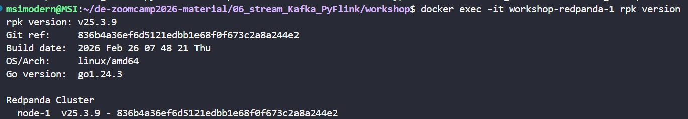
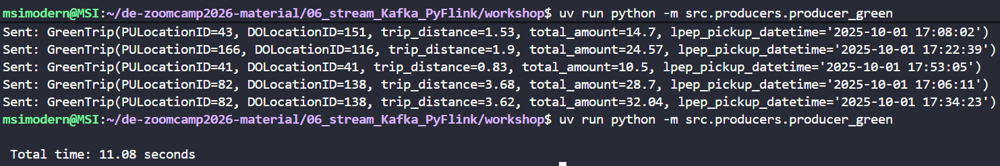
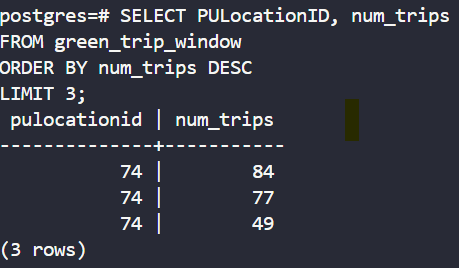
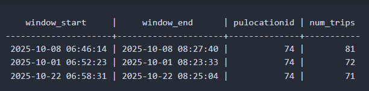
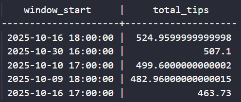

This post is part of a series where I document my learnings from the “Data Engineering Zoomcamp” course, created by DataTalksClub. The course material can be found on GitHub here: [DataTalksClub/data-engineering-zoomcamp: Free Data Engineering course!](https://github.com/DataTalksClub/data-engineering-zoomcamp/tree/main)

In this homework, we'll practice streaming with Kafka (Redpanda) and PyFlink.
We use Redpanda, a drop-in replacement for Kafka. It implements the same protocol, so any Kafka client library works with it unchanged.
For this homework we will be using Green Taxi Trip data from October 2025:
- [green_tripdata_2025-10.parquet](https://d37ci6vzurychx.cloudfront.net/trip-data/green_tripdata_2025-10.parquet)
<br>

### **Setup**

We'll use the same infrastructure from the [workshop](https://github.com/DataTalksClub/data-engineering-zoomcamp/blob/main/07-streaming/workshop).

Follow the setup instructions: build the Docker image, start the services:

```
cd 07-streaming/workshop/
docker compose up -d
```

This gives us:

- Redpanda (Kafka-compatible broker) on `localhost:9092`
- Flink Job Manager at [http://localhost:8081](http://localhost:8081/)
- Flink Task Manager
- PostgreSQL on `localhost:5432` (user: `postgres`, password: `postgres`)
```(docker exec -it workshop-postgres-1 psql -U postgres -d postgres)```

If you previously ran the workshop and have old containers/volumes, do a clean start:

```
docker compose down -v
docker compose build
docker compose up -d
```

Note: the container names (like `workshop-redpanda-1`) assume the directory is called `workshop`. If you renamed it, adjust accordingly.
<br>

### **Question 1. Redpanda version**

Run `rpk version` inside the Redpanda container:

```
docker exec -it workshop-redpanda-1 rpk version
```
 output:



**Answer: The version of Redpanda is v25.3.9**
<br>

### **Question 2. Sending data to Redpanda**

Create a topic called `green-trips`:

```
docker exec -it workshop-redpanda-1 rpk topic create green-trips
```

Now write a producer to send the green taxi data to this topic.
To solve this question, **[producer_green.py](https://github.com/ananurkaromah/de-zoomcamp2026-material/blob/main/06_stream_Kafka_PyFlink/workshop/src/producers/producer_green.py)** file was created.
Read the parquet file and keep only these columns:

- `lpep_pickup_datetime`
- `lpep_dropoff_datetime`
- `PULocationID`
- `DOLocationID`
- `passenger_count`
- `trip_distance`
- `tip_amount`
- `total_amount`

Convert each row to a dictionary and send it to the `green-trips` topic. 

```
import pandas as pd
from kafka import KafkaProducer
import time
from src.models import trip_from_row, serializer

url = "https://d37ci6vzurychx.cloudfront.net/trip-data/green_tripdata_2025-10.parquet"

df = pd.read_parquet(url).head(1000)

producer = KafkaProducer(
    bootstrap_servers='localhost:9092',
    value_serializer=serializer
)

topic = "green-trips"

# START TIMER
t0 = time.time()

for _, row in df.iterrows():
    trip = trip_from_row(row)
    producer.send(topic, value=trip)
    time.sleep(0.01)  # simulate streaming

producer.flush()

# END TIMER
t1 = time.time()

print(f"\n Total time: {t1 - t0:.2f} seconds")
```

How long did it take to send the data?

```
uv run python -m src.producers.producer_green
```

The process was executed several times with an output:



**Answer: The closest answer from the set of suggested answers is 10 seconds.**
<br>


### **Question 3. Consumer - trip_distance > 5?**

Write a Kafka consumer that reads all messages from the `green-trips` topic (set `auto_offset_reset='earliest'`).

The consumer_distance.py was created.

Count how many trips have a `trip_distance` > 5.0? 

```
uv run python -m src.consumers.consumer_distance
```

The consumer was executed and returned this output:

**Answer 8506**
<br>
<br>

## **Part 2: PyFlink (Questions 4-6)**

For the PyFlink questions, you'll adapt the workshop code to work with the green taxi data. The key differences from the workshop:

- Topic name: `green-trips` (instead of `rides`)
- Datetime columns use `lpep_` prefix (instead of `tpep_`)
- You'll need to handle timestamps as strings (not epoch milliseconds)

You can convert string timestamps to Flink timestamps in your source DDL:

```
lpep_pickup_datetime VARCHAR,
event_timestamp AS TO_TIMESTAMP(lpep_pickup_datetime, 'yyyy-MM-dd HH:mm:ss'),
WATERMARK FOR event_timestamp AS event_timestamp - INTERVAL '5' SECOND
```

Before running the Flink jobs, create the necessary PostgreSQL tables for your results.

Important notes for the Flink jobs:

- Place your job files in `workshop/src/job/` - this directory is mounted into the Flink containers at `/opt/src/job/`
- Submit jobs with: `docker exec -it workshop-jobmanager-1 flink run -py /opt/src/job/your_job.py`
- The `green-trips` topic has 1 partition, so set parallelism to 1 in your Flink jobs (`env.set_parallelism(1)`). With higher parallelism, idle consumer subtasks prevent the watermark from advancing.
- Flink streaming jobs run continuously. Let the job run for a minute or two until results appear in PostgreSQL, then query the results. You can cancel the job from the Flink UI at [http://localhost:8081](http://localhost:8081/)
- If you sent data to the topic multiple times, delete and recreate the topic to avoid duplicates: `docker exec -it workshop-redpanda-1 rpk topic delete green-trips`
<br>

### **Question 4. Tumbling window - pickup location**

Create a Flink job that reads from `green-trips` and uses a 5-minute tumbling window to count trips per `PULocationID`. 

Write the results to a PostgreSQL table with columns: `window_start`, `PULocationID`, `num_trips`.

The job **[green-trips](https://github.com/ananurkaromah/de-zoomcamp2026-material/blob/main/06_stream_Kafka_PyFlink/workshop/src/job/green_window_job.py)** was created and then added to Flink with:

```
docker exec -it workshop-jobmanager-1 flink run \
    -py /opt/src/job/green_window_job.py \
    --pyFiles /opt/src -d
```

Run:
```
uv run python -m src.producers.producer_green
```

After a while, this query was executed:

```
SELECT PULocationID, num_trips
FROM green_trip_window
ORDER BY num_trips DESC
LIMIT 3;
```

Result:


Returning this results:

**Answer: Therefore, the `PULocationID` with the most trips in a single 5-minute window is 74.**
<br>


### **Question 5. Session window - longest streak**

Create another Flink job that uses a session window with a 5-minute gap on `PULocationID`, using `lpep_pickup_datetime` as the event time with a 5-second watermark tolerance.

Write the results to a PostgreSQL table named `green_session` and find the `PULocationID` with the longest session (most trips in a single session).

The job **[green_session_job.py](https://github.com/ananurkaromah/de-zoomcamp2026-material/blob/main/06_stream_Kafka_PyFlink/workshop/src/job/green_session_job.py)** was written for to accomplish this. Then it was added to PyFlink with:

```
docker exec -it workshop-jobmanager-1 flink run \
    -py /opt/src/job/green_session_job.py \
    --pyFiles /opt/src -d
```


Producer run:
```
uv run python -m src.producers.producer_green
```


How many trips were in the longest session?

After processing all the events with the job, this query:

```
SELECT *
FROM green_trip_session
ORDER BY num_trips DESC
LIMIT 3;
```

Output:


**Answer: The longest streak was one of 81 rides.**
<br>


### **Question 6. Tumbling window - largest tip**

Create a Flink job that uses a 1-hour tumbling window to compute the total `tip_amount` per hour (across all locations).

The job **[green_tips_per_hour_job.py](https://github.com/ananurkaromah/de-zoomcamp2026-material/blob/main/06_stream_Kafka_PyFlink/workshop/src/job/green_tips_per_hour_job.py)** was created 

Then it was added to PyFlink with:

```
docker exec -it workshop-jobmanager-1 flink run \
  -py /opt/src/job/green_tips_per_hour_job.py \
  --pyFiles /opt/src -d
```


Producer run:
```
uv run python -m src.producers.producer_green
```

Then, this query:

```
SELECT *
FROM green_tips_per_hour
ORDER BY total_tips DESC
LIMIT 5;
```

Output:


Which hour had the highest total tip amount?

**Answer: So the hour with the highest total tip amount was 2025-10-16 18:00:00.**