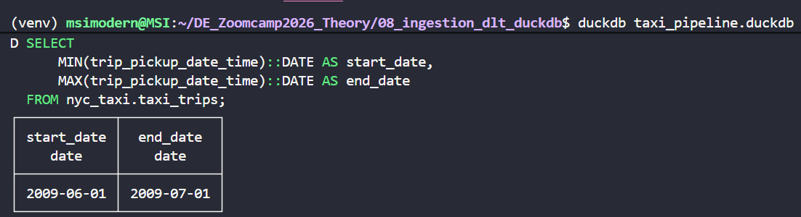
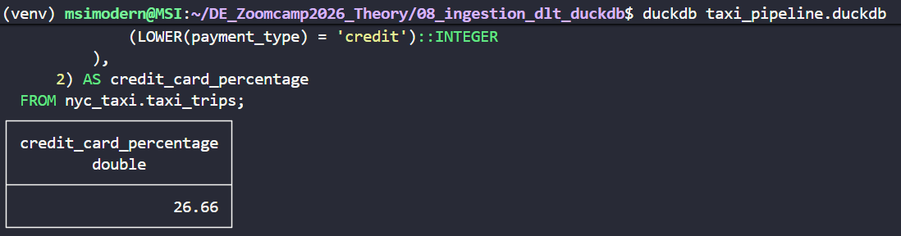
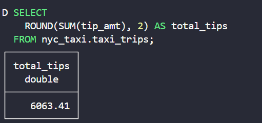

### Workshop 1: Ingestion with dlt for Data Engineering Zoomcamp 2026
This document contains the complete solutions for 
**Challenge Workshop 1: Ingestion with dlt**  
(Data Engineering Zoomcamp 2026 – DataTalksClub).
All the work in the other repisatory : [DE_Zoomcamp2026_Theory ](https://github.com/ananurkaromah/DE_Zoomcamp2026_Theory)
<br>

#### Question 1

**What is the start date and end date of the dataset?**

```jsx
SELECT 
      MIN(trip_pickup_date_time)::DATE AS start_date,
      MAX(trip_pickup_date_time)::DATE AS end_date
  FROM nyc_taxi.taxi_trips;
```



**Answer:**

**2009-06-01 to 2009-07-01**
<br>
<br>

#### Question 2

**What proportion of trips are paid with credit card?** 

```jsx
SELECT  
    ROUND(
        100.0 * AVG(
            (LOWER(payment_type) = 'credit')::INTEGER
        ),
    2) AS credit_card_percentage
FROM nyc_taxi.taxi_trips;
```


**Answer:**

**26.66%**

<br>
<br>

#### Question 3.

**What is the total amount of money generated in tips?** 

```jsx
SELECT 
  ROUND(SUM(tip_amt), 2) AS total_tips
FROM nyc_taxi.taxi_trips;
```



**Answer:**

**6063,41**